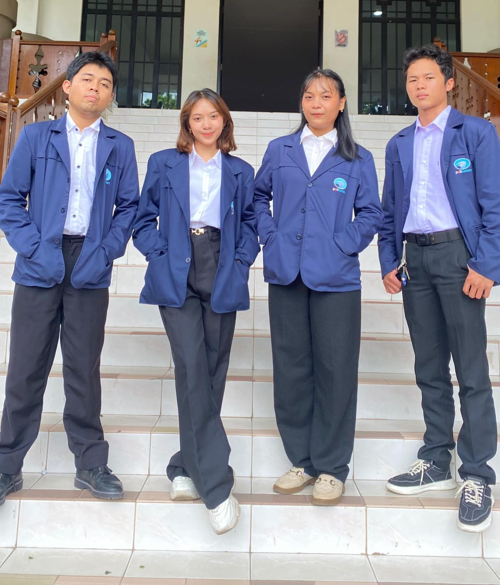

<div align="center">

# 📝 SmartNote
### Platform Notulen Digital Modern untuk Kolaborasi Tim yang Lebih Cerdas

[](http://smartnote.wuaze.com)
[](https://www.php.net/)
[](https://www.mysql.com/)
[](https://getbootstrap.com/)
[](LICENSE)

[**Kunjungi Website 🚀**](http://smartnote.wuaze.com) • [**Laporkan Bug 🐛**](mailto:alphatecha13@gmail.com) • [**Hubungi Kami 📱**](https://wa.me/6281371254173)

<br/>

<br/>
<br/>

</div>

---

## 🌟 Tentang SmartNote

**SmartNote** adalah solusi inovatif untuk mengelola seluruh aspek administrasi rapat dalam satu platform terpusat. Dikembangkan oleh tim **Alpha Tech** dari **Politeknik Negeri Batam**, aplikasi ini dirancang untuk memudahkan proses pencatatan, pengarsipan, hingga distribusi hasil rapat kepada seluruh anggota secara efisien dan transparan.

Link Website:
http://smartnote.wuaze.com
## ✨ Fitur Unggulan

- 📂 **Arsip Digital**: Simpan seluruh riwayat rapat Anda secara terorganisir dalam satu tempat yang aman.
- 📎 **Multi-Lampiran**: Lampirkan berbagai jenis dokumen (PDF, Word, Gambar) sebagai pendukung notulen Anda.
- 👥 **Manajemen Peserta**: Kelola hak akses pengguna, di mana notulis dapat menginput data dan peserta dapat membaca hasilnya secara mandiri.
- 📱 **Responsif**: Tampilan modern yang nyaman diakses melalui perangkat desktop maupun mobile.
- 🛡️ **Keamanan Data**: Sistem autentikasi yang memastikan data rapat hanya dapat diakses oleh pihak yang berwenang.

## 🛠️ Tech Stack

- **Backend**: PHP 7.4+
- **Database**: MySQL / MariaDB
- **Frontend Framework**: Bootstrap 5.3
- **Icons & UI**: Bootstrap Icons & Google Fonts (Plus Jakarta Sans)
- **Server**: Apache (via Laragon/XAMPP)

## 🚀 Instalasi Lokal

Ingin menjalankan proyek ini di komputer Anda sendiri? Ikuti langkah-langkah berikut:

1.  **Clone Repository**
    ```bash
    git clone https://github.com/rianandikasirait/smartnote.git
    cd smartnote
    ```

2.  **Impor Database**
    - Buat database baru bernama `notulen` di phpMyAdmin Anda.
    - Impor file `notulen.sql` yang ada di direktori root proyek.

3.  **Konfigurasi Koneksi**
    - Buka file `koneksi.php`.
    - Sesuaikan `db_user`, `db_pass`, dan `db_name` dengan pengaturan MySQL Anda.
    ```php
    $conn = mysqli_connect("localhost", "root", "", "notulen");
    ```

4.  **Jalankan Server**
    - Letakkan folder proyek di dalam folder `www` (Laragon) atau `htdocs` (XAMPP).
    - Akses melalui browser: `http://localhost/smartnote`.

## 👥 Tim Pengembang (Alpha Tech)

Kami adalah mahasiswa Politeknik Negeri Batam yang berdedikasi membangun solusi digital masa depan:

- **Email**: alphatecha13@gmail.com
- **Instagram**: [@smart_note_if1a3](https://www.instagram.com/smart_note_if1a3/)
- **WhatsApp**: [+62 813-7125-4173](https://wa.me/6281371254173)

---

<p align="center">
  Dibuat dengan ❤️ oleh <b>Alpha Tech</b> &copy; 2025
</p>
